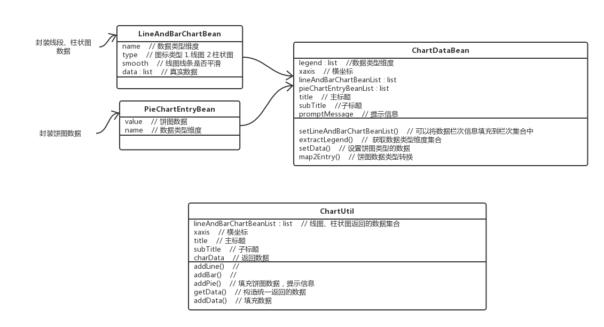
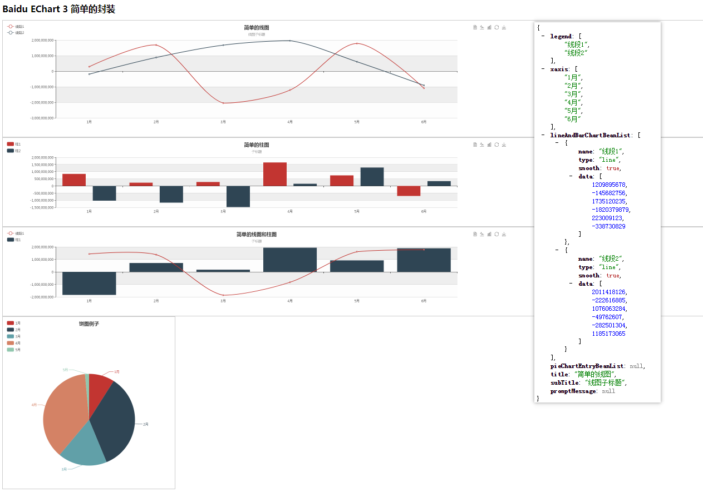

### UML 图解

### JSON 数据格式

PS：

后端在返回前端图表数据时，可以参考这个 demo，使用画图工具画了张图帮助大家理解每个方法的作用。

参考的是 [xwjie](https://github.com/xwjie/SpringBootEChart) 的开源代码，无意中看到这个 demo，clone 后在本地运行了一下，发现后端返回的数据很丰富，就修改了一下，方便以后用到项目中去。

数据格式大家可以根据自己的需要适当修改。
